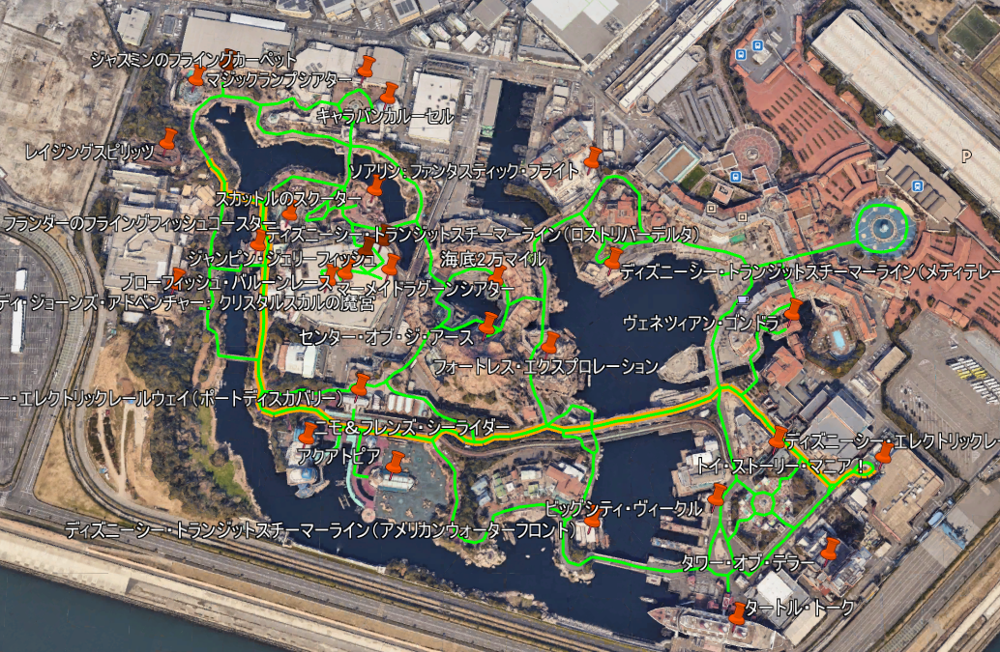

# disney-network

## 概要

経路探索用にディズニーランド・シーのネットワークを作成します。

グラフアルゴリズムの勉強などにお使いください。

## 必要なもの
```
Python3
Make
```

## デモ
```
pip install -r requirments.txt

# ネットワークデータ作成
make convert

# 経路探索
make search

```

## もう少し詳しい使い方
* `make convert` で `/data` 以下にネットワークデータ(json)が生成されます
  * デモの経路探索のスタート・ゴールには、`/data` 配下に生成される `spots.json` の `spot_id` を指定します
* 経路探索で生成されたkmlをGoogle Earthなどに読み込ませると、経路線を確認することができます
  * 例えば「トイ・ストーリー・マニア！」から「レイジングスピリッツ」までの経路はこんなふうに描画されます


